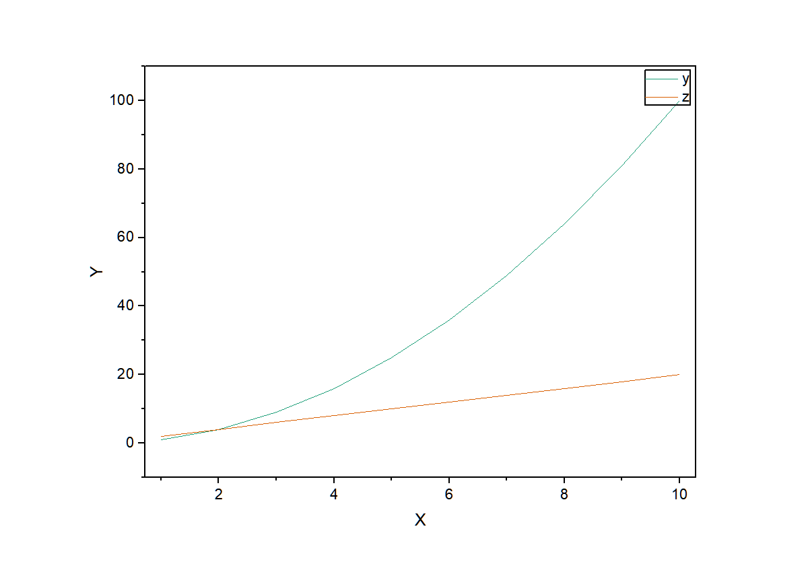
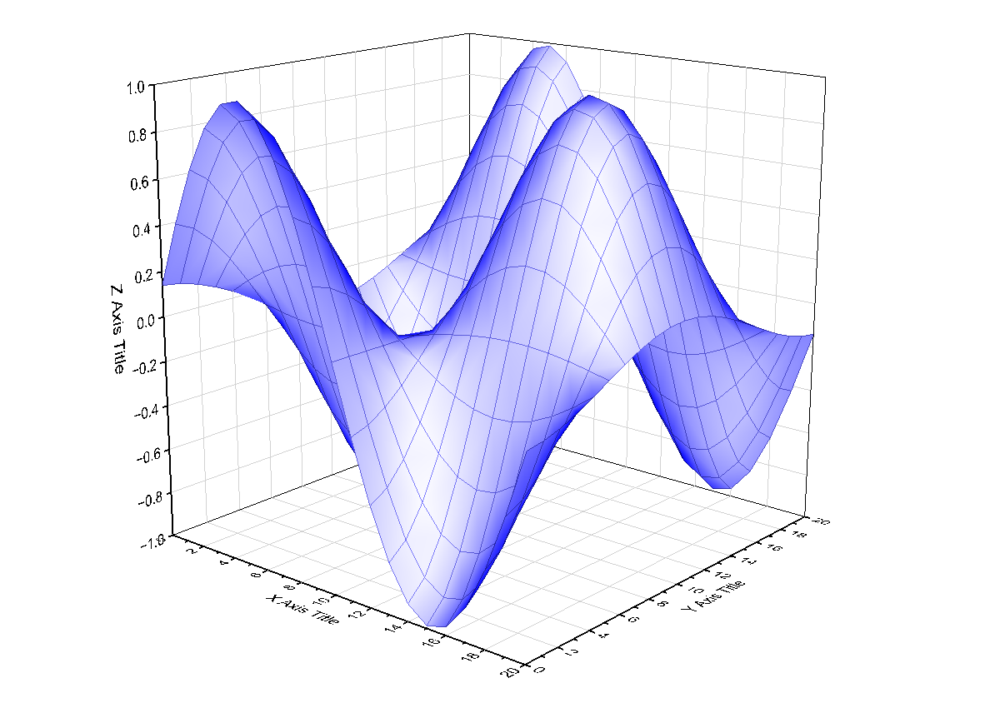

# DSH Origin Plugin · DeepSeek Harness × Origin 一键画图

让 **DeepSeek Harness (DSH)** 的 AI 对话直接驱动本机 **Origin**（科学绘图软件）自动画图并导出 **PNG / SVG**。

- 🤖 对话触发：`「用 Origin 画 y=x² 折线图并导出 PNG」` → 模型自动调用工具 → 图片落盘
- 🔌 官方 MCP 桥接：通过 DSH 内置的 `@deepseek-ai/dsh-mcp-client` 注册为原生工具 `mcp__origin__*`
- 🧪 2D 图：**line / scatter / line_symbol / column**，多列数据、批量 Y 序列
- 🧬 进阶：**删除/裁剪数据点**、**线性/非线性拟合**（拟合曲线上图）、**3D 表面图 / 3D 散点图**
- 🔒 多会话并发安全：专用 COM 线程 + 单实例语义，实测 8 线程并发 8/8 通过
- 🛡 不崩溃：所有错误返回结构化 JSON + 中文排查提示

  

```
DSH 对话（多会话并发）
   │  mcp__origin__origin_plot_file / origin_write_data / ...
   ▼
@deepseek-ai/dsh-mcp-client（DSH 官方 MCP 桥接）
   │  stdio 子进程
   ▼
origin_mcp_server.py（MCP 服务器，Python mcp SDK）
   │  专用 COM 线程（串行化）
   ▼
origin_engine.py（originpro → OriginExt → comtypes → COM）
   ▼
Origin64.exe（单实例 COM 自动化服务器）
```

## 快速开始

### 1. 环境要求

- Windows + 已安装 [Origin](https://www.originlab.com/)（实测 OriginPro 2026b；2018+ 一般均可）
- Python 3.10+（本插件自带独立 venv，不污染系统环境）
- DeepSeek Harness（DSH Desktop 或 `dsh` CLI，需含 `@deepseek-ai/dsh-mcp-client`）

### 2. 安装

```bat
git clone https://github.com/Fantasality/dsh-origin-plugin.git "%USERPROFILE%\dsh_origin_plugin"
cd "%USERPROFILE%\dsh_origin_plugin"

:: 创建独立 venv 并安装依赖
python -m venv .venv
.venv\Scripts\python.exe -m pip install mcp originpro pywin32 numpy

:: 冒烟验证 Origin COM 链路（需已安装 Origin；未运行会自动启动）
.venv\Scripts\python.exe -X utf8 smoke\origin_com_smoke_test.py
:: 预期结尾: RESULT: OK  files={'comtest.png': ..., 'comtest.svg': ...}
```

### 3. 注册到 DSH

```powershell
powershell -ExecutionPolicy Bypass -File "%USERPROFILE%\dsh_origin_plugin\register_to_dsh.ps1"
```

脚本会把以下条目追加到 `%APPDATA%\dsh-desktop\harness\profiles\web\cordis.patch.yml`
（自动备份、UTF-8 安全、幂等）：

```yaml
- insert:
    - id: mcp-origin
      name: '@deepseek-ai/dsh-mcp-client'
      config:
        serverName: origin
        transport: stdio
        command: 'C:/Users/<你>/dsh_origin_plugin/.venv/Scripts/python.exe'
        args: ['-X', 'utf8', 'C:/Users/<你>/dsh_origin_plugin/origin_mcp_server.py']
        toolCallTimeoutMs: 120000
```

然后 **重启 Harness**（DSH Desktop 菜单 Harness → Restart Harness，或 `Ctrl+Shift+R`）。
可选校验：`dsh --profile web --dump-config` 能看到 `mcp-origin` 条目。

> 机制说明：DSH 的插件生态是 Cordis 插件树 + `cordis.patch.yml` patch 层；MCP 服务器是官方
> 一等公民——`dsh-mcp-client` 会自动把外部 MCP 工具桥接为原生工具
> （名称 `mcp__<serverName>__<rawName>`），无需编写 TypeScript 插件即可接入 Python 能力。

### 4. 对话触发示例

| 你说 | 模型会调用 |
|---|---|
| 「用 Origin 画 y=x²（x=1..10）的折线图，导出 PNG」 | `mcp__origin__origin_plot_file` |
| 「把这两列数据画成散点图导出 SVG：x=[1,2,3,4,5], y=[3.1,4.9,7.2,8.8,11.3]」 | `mcp__origin__origin_plot_file` |
| 「先写数据再分步画图、导出」 | `origin_write_data` → `origin_plot` → `origin_export` |

## 工具清单

| MCP 工具 | 作用 | 关键参数 |
|---|---|---|
| `origin_status` | 连接状态 / Origin 进程数 / 环境 | 无 |
| `origin_write_data` | 多列数据写入工作表（dict 或二维列表） | `columns`, `worksheet`? |
| `origin_plot` | 画图（line/scatter/line_symbol/column） | `worksheet`, `plot_type`, `x_column`/`y_columns`, `title` |
| `origin_export` | 导出 PNG/SVG | `graph`, `fmt`, `file_path`, `width` |
| `origin_plot_file` | 一键：写数据→画图→导出 | `columns`, `plot_type`, `fmt`, `file_path`, `width` |
| `origin_filter_data` | 删除/裁剪数据点（按行索引或 x 范围） | `worksheet`, `drop_rows`, `x_min`/`x_max` |
| `origin_fit` | 线性/非线性拟合，拟合曲线上图 | `worksheet`, `x_column`/`y_column`, `kind`(linear/ExpDec1/Gauss/...), `plot_curve` |
| `origin_plot3d` | 3D 表面图 / 3D 散点图并导出 | `data`, `plot_type`(surface/scatter), `fmt`, `file_path` |

## 进阶能力

### 删除/裁剪数据点（`origin_filter_data`）

```python
# 删除第 2/5/9 行（0 起始索引）
origin_filter_data(worksheet="[Book1]Sheet1", drop_rows=[2, 5, 9])
# 只保留 x ∈ [0, 15] 的数据（x 列自动裁剪，NaN 填充尾部，图上不显示）
origin_filter_data(worksheet="[Book1]Sheet1", x_min=0, x_max=15)
```

### 拟合（`origin_fit`）

- `kind="linear"`：线性拟合，返回 slope / intercept 及误差；
- `kind="ExpDec1"` / `"Gauss"` / `"Polynomial"` / `"Lorentz"` / `"Sigmoid"` 等：
  Origin 内置拟合函数名（非线性最小二乘，返回全部参数 + cod/R² 等统计量）；
- `plot_curve=True`：自动生成「原始散点 + 拟合曲线」图。

实测参数还原精度：线性 slope=2.035（真值 2.0）；ExpDec1 A1=5.08（真值 5.0）、k=0.518（真值 0.5）、cod=0.997。

### 3D 图（`origin_plot3d`）

```python
# 3D 表面：z 为 2D 网格（自动生成 X/Y 索引网格，或提供 x/y 向量）
origin_plot3d(data={"z": [[1, 2, 3], [4, 5, 6], [7, 8, 9]]}, plot_type="surface")
# 3D 散点：x/y/z 三个等长列表
origin_plot3d(data={"x": [...], "y": [...], "z": [...]}, plot_type="scatter")
```

表面图走 Origin 原生 `GLparafunc` 模板（matrix Z/X/Y 三对象），散点走 `plotxy plot:=310`。

## 并发 / 多会话稳定性设计

Origin 是**单实例 COM 自动化服务器**，且 comtypes 的 COM 接口指针有**线程亲和性**
（实测跨线程调用报「对象没有连接到服务器」）。本插件的对策：

1. **专用 COM 线程**：所有 Origin 操作投递到唯一工作线程串行执行（任务队列），
   同时解决线程亲和性与并发互踩；
2. **单实例语义**：连接前强制 `OriginExt.ApplicationSI`（复用已运行主实例），
   杜绝多 Origin 进程导致的 COM 连错实例（实测多实例会让 `LT_execute` 报异常）；
3. **唯一命名空间**：每次调用新建 `DSH_<8hex>` 工作表/图，互不覆盖；
4. **多进程加固**：设置环境变量 `ORIGIN_IPC_LOCK=1` 可启用 Windows 命名互斥体，
   覆盖多 DSH 实例同时操作同一 Origin 的极端场景；
5. 实测：8 线程并发各画一张图 **8/8 通过**，单张耗时约 1~2 秒。

## 目录结构

```
dsh-origin-plugin/
├── origin_engine.py          # 核心引擎：连接/写数/画图/导出/锁/错误处理
├── origin_mcp_server.py      # MCP 服务器（DSH 对话入口），自带自测模式
├── demo_call.py              # 最小可运行示例（不依赖 MCP）
├── register_to_dsh.ps1       # 注册脚本（幂等/UTF-8 安全/自动备份）
├── unregister_from_dsh.ps1   # 卸载脚本
├── smoke/
│   ├── origin_com_smoke_test.py   # COM 链路冒烟测试
│   └── mcp_handshake_test.mjs     # 用 DSH 同款 Node SDK 验证 MCP 握手
└── docs/example.png          # 示例输出图
```

## 自测

```bat
:: 引擎级全链路（写数→画图→PNG→SVG）
.venv\Scripts\python.exe -X utf8 origin_mcp_server.py --selftest

:: 8 线程并发稳定性
.venv\Scripts\python.exe -X utf8 origin_mcp_server.py --concurrency-test

:: MCP 协议级（模拟 DSH 客户端，验证 8 个工具）
.venv\Scripts\python.exe -X utf8 origin_mcp_server.py --mcp-test

:: 进阶能力（删点/拟合/3D）
.venv\Scripts\python.exe -X utf8 smoke\advanced_test.py

:: 用 DSH 自带 Node MCP SDK 握手（与 dsh-mcp-client 同款）
node smoke\mcp_handshake_test.mjs

:: 最小调用示例
.venv\Scripts\python.exe -X utf8 demo_call.py
```

## 端到端验证清单

- [ ] smoke 测试输出 `RESULT: OK`，`output\comtest.png` 存在
- [ ] `--selftest` 输出 `SELFTEST OK`
- [ ] `--concurrency-test` 输出 `CONCURRENCY-TEST OK`（8/8）
- [ ] `--mcp-test` 输出 `MCP-TEST OK`（5 个工具可见）
- [ ] `mcp_handshake_test.mjs` 输出 `HANDSHAKE-TEST OK`
- [ ] `register_to_dsh.ps1` 执行成功，`dsh --profile web --dump-config` 可见 mcp-origin
- [ ] 重启 Harness 后新对话触发画图，返回 PNG 路径且图片内容正确
- [ ] 同时开 2~3 个对话各画不同图，互不干扰

## 常见问题

| 现象 | 处理 |
|---|---|
| 对话里没有 `mcp__origin__*` 工具 | Harness 未重启；或 `--dump-config` 无 mcp-origin（检查 patch 编码/语法） |
| `origin_status` 报 LT_execute 异常 | 存在多个 Origin64 进程：关闭多余 Origin 窗口只保留主实例后重试 |
| Origin 弹模态对话框导致调用卡住 | 自动化期间不要手动操作 Origin；关闭对话框重试 |
| 中文乱码 | 不要用 `Add-Content` 等 ANSI 方式追加 YAML；脚本已内置 UTF-8 写入 |
| 换机器 | 改 `register_to_dsh.ps1` 中的路径或直接编辑 patch 条目 |

## License

MIT © Fantasality
