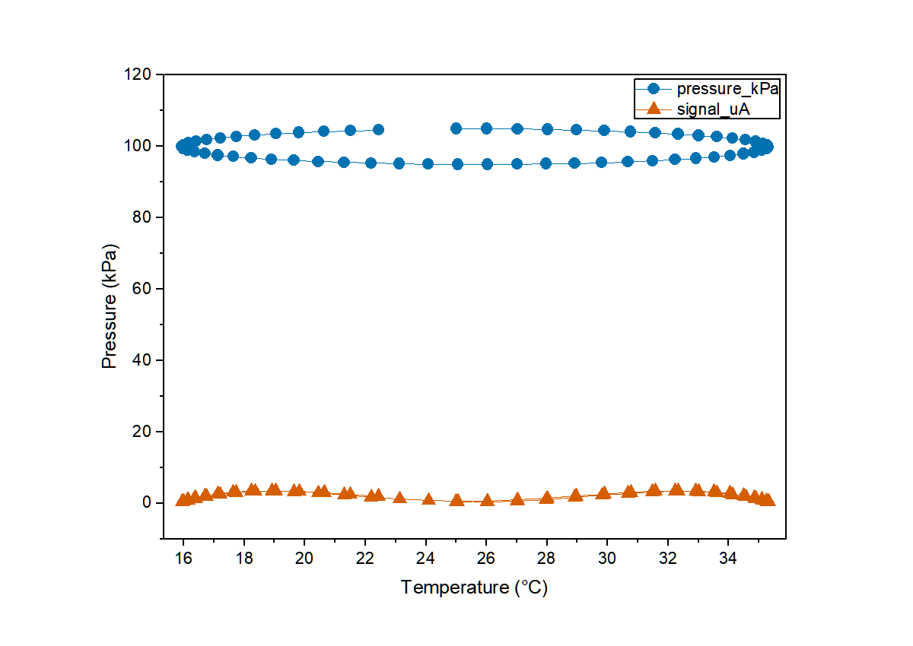

# DSH Origin Plugin · AI 对话驱动 OriginLab Origin 科学绘图

**国内可用 · DSH 生态 · MCP 桥接通用** —— 让 AI 对话直接驱动本机 **OriginLab Origin** 自动画图、分析、交付。
纯本机 COM 通道：**数据不出本机、无外网依赖、秒级响应**（对比需要外网的远程 Origin 服务（如 EditaPlot 类），国内访问不稳定且数据要上传第三方；本插件用你已装的正版 Origin，没有网络与隐私问题）。

- 🤖 对话触发：`「用 Origin 画 y=x² 折线图并导出 PNG」` → 模型自动调用工具 → 图片落盘
- 🔌 **双形态接入**：DSH 内经官方 `@deepseek-ai/dsh-mcp-client` 桥接为原生工具；DSH 外经 **`origin_mcp_stdio.py`** 接入任何标准 MCP 客户端（Kimi Code / Cursor / Claude Desktop / WorkBuddy），或 `npx dsh-origin-plugin` 直接拉起
- 🎨 **50 个工具**：2D 图 line/scatter/line_symbol/column/**histogram/box/bar** + 误差棒、3D、等高线、统计批
- 📋 **计划确认流（防陈旧）**：`origin_plot_plan` 逐列画像+待确认问题+`plan_hash` → `origin_execute_plan`（数据/映射变了报 `plan_stale`，语义不明/发表级/多组对比强制走此流）
- 🩺 **系统自检**：`origin_diagnose`——Origin 安装 / COM 注册 / 残留进程 / 导出目录权限，连不上先调它
- 📖 **场景速查**：`origin_cookbook`——八场景调用链 + 高频工具推荐默认参数（离线秒回）
- 🛡 **导出三级回退链**：save_fig → COM ImageExport → LabTalk expGraph，每级文件头校验（防静默失败假成功）
- ⏱ **trace_id + 耗时**：每次调用自动附带，定位失败阶段不靠猜
- 🎛 **细粒度改图**：`origin_edit_plot/axis/legend/page` —— 只换一条线的颜色、加粗、隐藏、挪图例、改轴范围、调纸张尺寸；`origin_manage_pages` 关窗/改名；`origin_inspect_graph` 先看清现状
- 📂 **文件导入**：`origin_load_file` 直接读 CSV/TXT/XLSX/XLS（中文路径/编码安全）
- 🧩 **领域模板**：多谱线堆叠偏移 / XRD 三件套 / 双Y轴 / 森林图 / 多面板（`origin_plot_template`）
- 📦 **可信交付**：`origin_export_delivery` 一键交付目录（图片+数据csv+**可编辑 OPJU**）；`origin_save_project` 单独存工程；`DSH_ORIGIN_NO_AUTO_SAVE=1` 可禁自动写 .opju（提示 Ctrl+S）
- ✨ **期刊级排版**：`style_mode`(journal/presentation) + `family` 调色板（带使用约束）+ 幂等 `graph_name` + 语义轴标题 + `style_overrides` 显式样式逐项回报
- 👁 **双保险校验**：`origin_view_graph` 内联图片（模型看、也能带给用户）+ `origin_verify_graph` 确定性反读（程序核）
- 🧮 **统计批**：t 检验 / ANOVA / PCA / Kaplan-Meier 生存分析（纯 numpy 自研，结果带 `confidence_note`：仅供探索，正式发表用 SPSS/R/Origin 复核）
- 🛡 **稳定错误码 + 恢复映射**：`error_code / recoverable / next_actions / recovery(policy+diagnose)` 四件套
- 🤝 **能力握手**：`origin_status` 返回 Origin 版本 + 已知坑矩阵（真机探针结论数据化）+ 特性表
- 🔒 多会话并发安全：专用 COM 线程 + 单实例语义，实测 8 线程并发 8/8 通过；`ORIGIN_SESSION=isolated` 不劫持用户窗口；`DSH_ORIGIN_AUTOKILL` 连接前自动清残留进程

  

**v2 排版示例**（3 序列 line_symbol，journal 样式 + ocean 调色板 + 语义轴标题 + 符号循环）：



> 权威设计/验证依据见 [docs/DESIGN.md](docs/DESIGN.md)（设计蓝图 + 真机探测矩阵 + 官方文档依据）。
> 行为细节以真机探针为准（本环境网络屏蔽 docs.originlab.com，无法抓取官方页）。

```
DSH 对话（多会话并发）
   │  mcp__origin__origin_plot_file / origin_write_data / ...
   ▼
@deepseek-ai/dsh-mcp-client（DSH 官方 MCP 桥接）
   │  stdio 子进程
   ▼
origin_mcp_server.py（MCP 服务器，Python mcp SDK）
   │  专用 COM 线程（串行化）
   ▼
origin_engine.py（originpro → OriginExt → comtypes → COM）
   ▼
Origin64.exe（单实例 COM 自动化服务器）
```

## 快速开始

> 🚀 **模型快速上手**：本插件自带 DSH 原生 **`origin-plotting` skill**（安装后自动注册，
> 见下方「skill 速查」），模型画图前加载 skill 或调用 `origin_help` 即可秒懂用法，
> **无需阅读本 README**。

### 两条使用路径（先选路，再动手）

- **快速路径**：数据语义明确、临时查看 → `origin_plot_file` / `origin_load_file`+`origin_plot`，一次调用出图。
- **正式路径**：发表级图 / 多组对比 / 列语义不明 → `origin_plot_plan` → 用户确认 questions → `origin_execute_plan`（带 `plan_hash` 防陈旧）→ `origin_verify_graph` → `origin_export_delivery`。
- 想不起调用链 → `origin_cookbook`（八场景速查 + 推荐默认参数）；出问题 → `origin_diagnose` 先定位。

### 1. 环境要求

- Windows + 已安装 [Origin](https://www.originlab.com/)（实测 OriginPro 2026b；2018+ 一般均可）
- Python 3.10+（本插件自带独立 venv，不污染系统环境）
- DSH 用户：DeepSeek Harness（DSH Desktop 或 `dsh` CLI，需含 `@deepseek-ai/dsh-mcp-client`）；
  **非 DSH 用户**：任何支持 MCP stdio 的客户端即可（Kimi Code / Cursor / Claude Desktop / WorkBuddy 等）

### 2. 安装

**方式 A —— 自动写入常见 AI 工具（v2.3.0 新增，推荐）**：

```bat
git clone https://github.com/Fantasality/dsh-origin-plugin.git "%USERPROFILE%\dsh_origin_plugin"
cd "%USERPROFILE%\dsh_origin_plugin"
python -m venv .venv
.venv\Scripts\python.exe -m pip install -r requirements.txt

:: 检测已安装的 AI 工具（Claude Desktop/Cursor/Windsurf/Cline/VS Code/WorkBuddy/Kimi Code）
python install.py --list
:: 写入 mcpServers 配置（自动备份原文件）
python install.py --yes
```

**方式 B —— npx 直接拉起（v2.3.0 新增）**：

```sh
npx -y dsh-origin-plugin --doctor       # 环境自检
npx -y dsh-origin-plugin                # 启动 stdio MCP 服务器
```

**方式 C —— 手动配置**：把下面片段合并进你客户端的 mcpServers
（或 `python origin_mcp_stdio.py --print-config` 打印各客户端的完整片段）：

```json
{"mcpServers": {"dsh-origin": {
  "command": "<venv python 绝对路径>",
  "args": ["<插件目录>/origin_mcp_stdio.py"]
}}}
```

**方式 D —— DSH bundle 一键安装**（见下文 2.1/3）：

```bat
:: 冒烟验证 Origin COM 链路（需已安装 Origin；未运行会自动启动）
.venv\Scripts\python.exe -X utf8 smoke\origin_com_smoke_test.py
:: 预期结尾: RESULT: OK  files={'comtest.png': ..., 'comtest.svg': ...}
```

### 2.1 以 bundle 方式安装（一键 / 插件市场）

本仓库声明了 DSH 标准的 **`dsh.bundle`** 清单（`package.json` → `cordis.patch.yml`），
因此可从 DSH 插件市场（`dsh-market` / awesome-dsh-plugin）一键收录，也可用命令安装：

```sh
# 方式一：从 GitHub 源码安装
dsh plugin --profile web add github:Fantasality/dsh-origin-plugin
# 方式二：从 npm 安装（预构建分发，跳过 building 授权）
dsh plugin add dsh-origin-plugin
```

装好后 `cordis.patch.yml` 会注册一个 `mcp-origin`（`@deepseek-ai/dsh-mcp-client`）。
**v2.0.3 起自动携带运行时依赖 `@deepseek-ai/dsh-mcp-client`**：市场安装
（`dsh plugin add`）会把它作为传递依赖装进 profile 的 node_modules——缺少它时 loader
无法按 `name` 解析该条目，工具会**静默永不注册**（DSH 照常启动、无任何报错）。
**v2.0.2 起 bundle 默认已自定位**：server 绝对路径由 `!!js` 在启动时按
`<DSH_HOME>/profiles/web/node_modules/dsh-origin-plugin/` 计算（DSH_HOME 缺省回退
`%USERPROFILE%/.dsh`），不再受进程工作目录影响；默认用系统 `python` 启动
`origin_mcp_server.py`。

> 📌 **安装此插件不会破坏 DSH 启动**：`failOnStartupError: false` —— server
> 连不上只记日志、不注册工具，DSH 正常启动。这是插件市场适配的核心约束，已内置。
> 唯一硬性红线：**不要在 profile 里再写第二条完整 `insert` 的 `mcp-origin`**（会触发
> `duplicate loader entry id: mcp-origin` 启动失败）；要用 venv，请用下面的
> config-only 覆盖。

**首次使用前仍需按上文「2. 安装」准备好 venv 依赖**（本插件是 Windows + Origin 本地
进程，无法纯源码免装运行）。若依赖装在独立 venv，在 profile 的 `cordis.patch.yml` 里
用**同一 id + config-only** 覆盖（覆盖是**整体替换** config，必须带全字段）：

```yaml
- id: mcp-origin
  config:
    serverName: origin
    transport: stdio
    command: 'C:/Users/<你>/dsh_origin_plugin/.venv/Scripts/python.exe'
    args: ['-X', 'utf8', 'C:/Users/<你>/dsh_origin_plugin/origin_mcp_server.py']
    env:
      PYTHONIOENCODING: utf-8
    failOnStartupError: false
    toolCallTimeoutMs: 120000
```

（层级：bundle patch → profile patch → `$DSH_HOME/cordis.patch.yml`，后层覆盖先层。
若你的 DSH profile 不是默认的 `web`，把自定位路径里的 `/profiles/web/` 换成你的
profile 名再覆盖。）

### 3. 注册到 DSH

```powershell
powershell -ExecutionPolicy Bypass -File "%USERPROFILE%\dsh_origin_plugin\register_to_dsh.ps1"
```

脚本会把以下 **config-only 覆盖**（注意：没有 `name`、没有 `insert`，只替换配置，
与 bundle 层 `mcp-origin` 合并、不产生重复条目；覆盖会整体替换 config，故带全字段）
追加到 `%APPDATA%\dsh-desktop\harness\profiles\web\cordis.patch.yml`
（自动备份、UTF-8 安全、幂等）：

```yaml
- id: mcp-origin
  config:
    serverName: origin
    transport: stdio
    command: 'C:/Users/<你>/dsh_origin_plugin/.venv/Scripts/python.exe'
    args: ['-X', 'utf8', 'C:/Users/<你>/dsh_origin_plugin/origin_mcp_server.py']
    env:
      PYTHONIOENCODING: utf-8
    failOnStartupError: false
    toolCallTimeoutMs: 120000
```

> ⚠️ 旧版脚本写入的是「完整 insert」，与 bundle 层组合会生成两条 `mcp-origin`
> → DSH 启动直接报 `duplicate loader entry id: mcp-origin`。v2.0.2 的脚本已改为
> config-only 覆盖；如果你手工写过旧格式，请删掉那条完整 insert，只保留上面的覆盖。

然后 **重启 Harness**（DSH Desktop 菜单 Harness → Restart Harness，或 `Ctrl+Shift+R`）。
可选校验：`dsh --profile web --dump-config` 能看到 `mcp-origin` 条目。

> 机制说明：DSH 的插件生态是 Cordis 插件树 + `cordis.patch.yml` patch 层；MCP 服务器是官方
> 一等公民——`dsh-mcp-client` 会自动把外部 MCP 工具桥接为原生工具
> （名称 `mcp__<serverName>__<rawName>`），无需编写 TypeScript 插件即可接入 Python 能力。

### 4. 对话触发示例

| 你说 | 模型会调用 |
|---|---|
| 「用 Origin 画 y=x²（x=1..10）的折线图，导出 PNG」 | `mcp__origin__origin_plot_file` |
| 「把这两列数据画成散点图导出 SVG：x=[1,2,3,4,5], y=[3.1,4.9,7.2,8.8,11.3]」 | `mcp__origin__origin_plot_file` |
| 「先写数据再分步画图、导出」 | `origin_write_data` → `origin_plot` → `origin_export` |

## 快速上手（skill + origin_help）

模型在对话中遇到 Origin 画图/分析任务时，有两种秒级上手通道：

1. **`origin-plotting` skill（DSH 原生机制）**：安装时自动写入
   `%APPDATA%\dsh-desktop\harness\skills\origin-plotting\SKILL.md` 与
   `~/.dsh\skills\origin-plotting\SKILL.md`。模型目录可见该 skill，按需加载后
   直接获得：数据格式、50 工具速查表、科学边界、12+ 个任务模板——**不用再读 README**；
2. **`mcp__origin__origin_help` 工具**：不连接 Origin、约 1ms 返回同一份速查
   （JSON 格式，含 usage/tools/templates/tips），任何时刻可调用。

两者内容一致、互为备份；工具 description 中也已内嵌快速用法提示。

## 工具清单

| MCP 工具 | 作用 | 关键参数 |
|---|---|---|
| `origin_status` | 连接状态 / Origin 进程数 / 环境 | 无 |
| `origin_help` | 快速使用速查（不连 Origin，秒回） | 无 |
| `origin_diagnose` | **系统自检**：Origin 安装/COM 注册/残留进程/导出目录权限 | `connect_probe`? |
| `origin_cookbook` | **场景速查**：八场景调用链 + 推荐默认参数 | `scenario`? |
| `origin_write_data` | 多列数据写入工作表（dict 或二维列表） | `columns`, `worksheet`? |
| `origin_plot` | 画图：line/scatter/line_symbol/column/**histogram/box/bar** + 误差棒 | `worksheet`, `plot_type`, `yerr_column`, `title` |
| `origin_export` | 导出 PNG/SVG | `graph`, `fmt`, `file_path`, `width` |
| `origin_plot_file` | 一键：写数据→画图→导出 | `columns`, `plot_type`, `fmt`, `file_path`, `width` |
| `origin_filter_data` | 删除/裁剪数据点（按行索引或 x 范围） | `worksheet`, `drop_rows`, `x_min`/`x_max` |
| `origin_fit` | 线性/非线性拟合（Origin 内置函数），拟合曲线上图 | `worksheet`, `kind`(linear/ExpDec1/Gauss/...), `plot_curve` |
| `origin_plot3d` | 3D 表面图 / 3D 散点图 | `data`, `plot_type`(surface/scatter) |
| `origin_stats` | 描述统计：count/mean/std/min/p25/median/p75/max/skew | `worksheet`, `columns` |
| `origin_transform` | 平滑/归一化/微分/插值（写回新列） | `worksheet`, `op`, `method`, `window`, `new_x` |
| `origin_integrate` | 数值积分 AUC（梯形法） | `worksheet`, `x_column`, `y_column` |
| `origin_fft` | FFT 频谱：主频提取 + 频谱图 | `worksheet`, `plot_spectrum`, `top` |
| `origin_correlate` | Pearson 相关矩阵 | `worksheet`, `columns` |
| `origin_peak_find` | 峰值检测（峰高/间距过滤） | `worksheet`, `min_height`, `min_distance` |
| `origin_histogram` | 直方图统计（可画图导出） | `worksheet`, `bins`, `plot` |
| `origin_plot_contour` | 等高线 / 填充等高线 / 3D 线框 | `data`, `plot_type` |
| `origin_catalog` | 动态工具目录（按分类列出全部工具，文档即实现） | `group` |
| `origin_error_codes` | 全部稳定错误码 + 恢复建议 | 无 |
| `origin_list_graphs` / `origin_list_sheets` | 列出图页 / 工作表页短名 | 无 |
| `origin_read_worksheet` | 读取工作表列数据（含列角色/点数） | `worksheet`, `columns`, `max_rows` |
| `origin_view_graph` | 图→**内联图片**（模型可看，不落盘） | `graph`, `max_width` |
| `origin_apply_style` | 对已有图应用排版/调色板/多序列区分 | `graph`, `style_mode`, `family`, `columns` |
| `origin_ttest` | t 检验：one / 两样本(Welch) / paired | `column_a`, `column_b`, `kind`, `mu` |
| `origin_anova` | 单因素方差分析（每组一列） | `columns` |
| `origin_pca` | 主成分分析（载荷/解释方差/得分） | `columns`, `scale`, `n_components` |
| `origin_survival` | Kaplan-Meier 生存分析 | `time_column`, `event_column` |
| `origin_load_file` | **导入本地文件** CSV/TXT/XLSX/XLS（中文安全） | `path`, `sheet`?, `worksheet`? |
| `origin_plot_plan` | **绘图计划**（离线：逐列画像+角色建议+待确认问题） | `columns`, `plot_type` |
| `origin_execute_plan` | **执行计划**（按 plan_id 写数→画图→导出） | `plan_id` |
| `origin_plot_template` | **领域模板**：stacked_spectra/xrd_pattern/dual_y/forest/multi_panel | `template_id`, `data` |
| `origin_verify_graph` | **确定性反读**（轴标题/字号/几何/图例/文件完整性） | `graph`, `expected_*` |
| `origin_save_project` | **保存可编辑 OPJU 工程** | `path` |
| `origin_export_delivery` | **一键交付目录**（源文件同级，图片+OPJU+核验） | `graph`, `source_path`, `fmts` |
| `origin_list_pages` | **列出全部页面**（图页/工作簿）+ 活动窗口 | 无 |
| `origin_inspect_graph` | **巡检现状**：图层几何/曲线样式/轴/图例/页面尺寸 | `graph` |
| `origin_edit_plot` | **逐条改曲线**：颜色/线宽/线型/符号/透明度/隐藏 | `graph`, `edits` |
| `origin_edit_axis` | **改轴**：标题/范围/刻度类型/网格/字号加粗 | `graph`, `axis`, `props` |
| `origin_edit_legend` | **改图例**：显示隐藏/字号/边框/四角锚点/文本 | `graph`, `options` |
| `origin_edit_page` | **改纸张 cm 尺寸 / 图层位置（%页）/ 背景** | `graph`, `page_size_cm` |
| `origin_manage_pages` | **窗口管理**：关闭/激活/重命名/隐藏/复制 | `action`, `pages` |
| `origin_add_text` | **加文本标注**（峰位/条件说明） | `graph`, `text`, `x`, `y` |
| `origin_add_line` | **画辅助线**（vertical/horizontal/slope，Tafel 外推/阈值线） | `graph`, `kind` |
| `origin_column_formula` | **Origin 原生列公式**（函数名自动纠正 + 硬失败检测） | `worksheet`, `target`, `formula` |
| `origin_mask_points` | **屏蔽数据点**（NaN 化隐藏，可逆） | `worksheet`, `condition` |
| `origin_peak_fit` | **多峰拟合**（Gauss/Lorentz 分峰） | `worksheet`, `x_column`, `y_column` |
| `origin_labtalk` | 逃生舱：任意 LabTalk（带激活+读回+NaN 防护） | `script` |

> 完整清单以 `origin_catalog` 为准（50 个工具，文档即实现永不脱节）。

## 已知失败场景（实测汇总）

完整的兼容性矩阵与 11 条实测失败场景（根因 + 处置）见 **[COMPATIBILITY.md](COMPATIBILITY.md)**。高频三条：

| 场景 | 处置 |
|---|---|
| 残留 Origin64 僵尸进程导致 COM 连不上 | `taskkill /F /IM Origin64.exe` 等 2 秒重连；或设 `DSH_ORIGIN_AUTOKILL=1` 自动清理 |
| LabTalk `log10()` 列公式静默无效 | LabTalk 底 10 对数是 `log()`；引擎 `origin_column_formula` 已自动纠正 |
| 渐变设色 + 同一 COM 任务内导出丢曲线（v2.2 遗留） | v2.3.0 已修复（导出拆独立 COM 任务）；请升级 |

## 进阶能力

### 删除/裁剪数据点（`origin_filter_data`）

```python
# 删除第 2/5/9 行（0 起始索引）
origin_filter_data(worksheet="[Book1]Sheet1", drop_rows=[2, 5, 9])
# 只保留 x ∈ [0, 15] 的数据（x 列自动裁剪，NaN 填充尾部，图上不显示）
origin_filter_data(worksheet="[Book1]Sheet1", x_min=0, x_max=15)
```

### 拟合（`origin_fit`）

- `kind="linear"`：线性拟合，返回 slope / intercept 及误差；
- `kind="ExpDec1"` / `"Gauss"` / `"Polynomial"` / `"Lorentz"` / `"Sigmoid"` 等：
  Origin 内置拟合函数名（非线性最小二乘，返回全部参数 + cod/R² 等统计量）；
- `plot_curve=True`：自动生成「原始散点 + 拟合曲线」图。

实测参数还原精度：线性 slope=2.035（真值 2.0）；ExpDec1 A1=5.08（真值 5.0）、k=0.518（真值 0.5）、cod=0.997。

### 3D 图（`origin_plot3d`）

```python
# 3D 表面：z 为 2D 网格（自动生成 X/Y 索引网格，或提供 x/y 向量）
origin_plot3d(data={"z": [[1, 2, 3], [4, 5, 6], [7, 8, 9]]}, plot_type="surface")
# 3D 散点：x/y/z 三个等长列表
origin_plot3d(data={"x": [...], "y": [...], "z": [...]}, plot_type="scatter")
```

表面图走 Origin 原生 `GLparafunc` 模板（matrix Z/X/Y 三对象），散点走 `plotxy plot:=310`。

## 科学分析（`origin_stats` / `origin_transform` / `origin_fft` 等）

| 能力 | 工具 | 说明 |
|---|---|---|
| 描述统计 | `origin_stats` | count/mean/std/min/p25/median/p75/max/skew |
| 平滑 | `origin_transform(op="smooth")` | 移动平均 / 中值滤波，窗口可调 |
| 归一化 | `origin_transform(op="normalize")` | minmax / zscore / sum |
| 数值微分 | `origin_transform(op="derivative")` | 基于 x 步长的梯度 |
| 插值 | `origin_transform(op="interpolate")` | 任意新 x 网格线性插值 |
| 积分/AUC | `origin_integrate` | 梯形法曲线下面积 |
| 频谱分析 | `origin_fft` | 幅度谱 + 主频提取 + 频谱图 |
| 相关性 | `origin_correlate` | Pearson 相关矩阵 |
| 峰值检测 | `origin_peak_find` | 局部极大值 + 峰高/间距过滤 |
| 直方图 | `origin_histogram` | bin 频数 + 柱状图 |

实测：FFT 对 2Hz 正弦（256 点、0.05s 采样）主频检出 2.031Hz；AUC 梯形法精度良好；
峰值检测对高斯峰（σ=0.5）在 x=6.0 处检出多个候选峰（配合 min_height/min_distance 收敛）。

## 画图类型速查（`origin_plot` / `origin_plot_file`）

| plot_type | 实现 | 说明 |
|---|---|---|
| line / scatter / line_symbol / column | add_plot | 基础 2D |
| histogram | numpy 分箱 + 柱状图 | 稳定可控 |
| box | Origin 原生 `box` 模板 | 箱线图 |
| bar | Origin 原生 `bar` 模板 | 条形图（真机验证可靠；plotxy 204/215 在 2026b 会渲成面积图/不出图） |
| + `yerr_column` | add_plot colyerr | 误差棒 |

通用排版参数（全部画图工具可用）：
- `style_mode`：default / **journal**（单栏 89mm·双栏 183mm·8pt 起）/ **presentation** —— 字号/线宽/刻度/几何真正落图；
- `family`：调色板（ocean/nightfall/duo_warm/forest/grey_tone/low_saturation/paired）；
- `graph_name`：幂等命名——同名重复调用**清旧重画**，图名稳定（不再累积 Graph2/3）；
- 轴标题：从列名自动语义推断（`temperature_C` → "Temperature (°C)"，`pressure_kPa` → "Pressure (kPa)"），经 `GLayer.axis('x'/'y').title` 可靠落图；
- 多序列自动区分：线型/符号循环 + 颜色（CVD 色盲安全）；密集数据自动降符号。

> 排坑记录：LabTalk `plotxy` 的列范围必须用 `[Book]1!B` 短名形式（`(n)` 索引形式对
> 部分图型静默失败）；box/bar 在真机上无可靠 plotxy 代码，统一改走 Origin 原生模板。

## 期刊级排版（`plot_style.py`，v2 新增）

采用感知色彩度量（clean-room 自研，未复制任何第三方代码/文档）：

- **OKLab 色彩空间**计算调色板两两感知色差，保证多序列可分辨；
- **CVD 色盲模拟**（protanopia/deuteranopia/tritanopia 转换矩阵）筛选色盲可读方案；
- **白底对比度**（WCAG 对比度）保证线条/符号在期刊白底上清晰；
- 每种 `family` 返回 `min_oklab_distance / min_contrast_white / min_cvd_distance` 指标，
  且每一步给出 `reason`，可审计；
- `style_mode` 预设（journal/presentation）给出目标图宽（mm）、最小字号、线宽、刻度长度。

## 视觉校验（`origin_view_graph`，v2 新增）

出图后模型**不必先导出文件**再想办法看：

```json
{"graph": "styled3"}   // 返回 [文本摘要, ImageContent]：模型直接看到图
```

- 图片为内联 `mcp.types.ImageContent`（PNG base64），不落盘；`max_width` 控制 token 成本；
- 适合让视觉模型核对：图型是否对、配色是否可区分、轴标题是否合理；
- 实配示例（识图模型核对过）：3 序列 line_symbol，X=温度(°C)、Y=压力(kPa)，
  蓝圈/橙三角，图例在右上角。

## 统计批（纯 numpy 自研，无 scipy，v2 新增）

| 工具 | 统计量 | 说明 |
|---|---|---|
| `origin_ttest` | t / df / p | one（vs 指定 mu）/ 两样本（Welch）/ 配对；t 分布尾概率用 Lanczos γ + 连分数不完全 β 实现 |
| `origin_anova` | F / p / η² | 单因素，每组一列；F 分布尾概率同样自研 |
| `origin_pca` | 解释方差比 / 载荷 / 得分 | SVD；`scale=True` 标准化 |
| `origin_survival` | KM 表 / 中位生存时间 | 事件+删失；中位时间为存活率过 0.5 的插值点 |

示例：`origin_ttest({"worksheet":"[Book1]Sheet1","column_a":"a","column_b":"b","kind":"two"})`
→ `{"statistic": -1.39, "df": 2.31, "p_value": 0.284}`。

## 稳定错误码（`origin_errors.py`，v2 新增）

所有调用（含遗留错误路径）统一返回：

```json
{"ok": false, "error_code": "worksheet_not_found", "error": "...",
 "recoverable": true, "next_actions": ["..."]}
```

- 常用枚举：`worksheet_not_found` / `column_not_found` / `invalid_request` /
  `origin_operation_error` / `graph_not_found` / `unsupported_origin_feature`（如 3D 散点无输出时优雅降级）；
- `_synchronized` 边界自动把历史 `{ok:false,error}` 升级为结构化错误；
- `origin_error_codes` 一次返回全部枚举与恢复建议，模型可据此安全分支重试。

## 并发 / 多会话稳定性设计

Origin 是**单实例 COM 自动化服务器**，且 comtypes 的 COM 接口指针有**线程亲和性**
（实测跨线程调用报「对象没有连接到服务器」）。本插件的对策：

1. **专用 COM 线程**：所有 Origin 操作投递到唯一工作线程串行执行（任务队列），
   同时解决线程亲和性与并发互踩；
2. **单实例语义**：连接前强制 `OriginExt.ApplicationSI`（复用已运行主实例），
   杜绝多 Origin 进程导致的 COM 连错实例（实测多实例会让 `LT_execute` 报异常）；
3. **唯一命名空间**：每次调用新建 `DSH_<8hex>` 工作表/图，互不覆盖；
4. **多进程加固**：设置环境变量 `ORIGIN_IPC_LOCK=1` 可启用 Windows 命名互斥体，
   覆盖多 DSH 实例同时操作同一 Origin 的极端场景；
5. 实测：8 线程并发各画一张图 **8/8 通过**，单张耗时约 1~2 秒。

## 细粒度改图（v2.2 新增：AI 帮你微调已有图）

新手最常提的需求是"只改一点点"，例如「把第二条线换成红色」「这条曲线加粗一点」
「图例挪到右上角」「冲掉几个多余的工作簿」。这类操作对应的是一整套编辑工具，
且每一次改动都带**读回校验**：

```
origin_inspect_graph(graph)                      # 先看清现状（几何/颜色/轴/图例/纸张）
origin_edit_plot(graph, [{"plot": 1, "color": "#D55E00"}])          # 只改第 2 条线颜色
origin_edit_plot(graph, [{"plot": 0, "line_width_pt": 2.5}])        # 第 1 条加粗
origin_edit_axis(graph, axis="y", title="Pressure (kPa)",
                 from_value=80, to_value=140,
                 props={"show_grids": 1, "label_font_pt": 12, "label_bold": 1})
origin_edit_legend(graph, {"position": "tr", "font_size_pt": 12})   # 挪到右上角
origin_edit_page(graph, page_size_cm={"width": 8.9, "height": 6.5}) # 投稿单栏尺寸
origin_manage_pages("close", pages=["Book3", "Book4"])              # 关掉多余窗口
```

**为什么这些改动是安全的**（三条纪律，全部由真机探针证据支撑）：

1. **COM 优先**：探针矩阵显示 originpro 的图层/曲线作用域读写
   （`plot_list` / `gl.get_int` / `set_int` / `axis` 属性 / `p.color`）**与活动窗口无关**，
   任何时候都可靠；LabTalk 裸表达式（`xb.*` / `legend.*` / `layer.*`）只在目标图页
   恰好是活动窗口时才解析，否则静默返回 NaN 或落到别的窗口（实测 `layer.left`
   会读到工作簿的几何）。
2. **激活必须复核**：所有 LabTalk 路径先 `activate()` 再以 `is_active()` / `page.name$`
   复核，不符就返回 `window_activation_failed`，绝不"以为激活成功"。
3. **写入必读回**：每项改动返回 `{item, requested, status, readback}`，
   status 为 applied / applied_unverified（无读回的通道，如线宽，需目视确认）/
   applied_adjusted（Origin 钳制了值）/ rejected（附原因）；
   **NaN 读回一律判未生效**（NaN 比较恒为 False，是个会假成功的坑，已修）。

## 已修的三条实测缺陷（v2.2）

| 缺陷 | 现象 | 修复 |
|---|---|---|
| verify 曲线数误判 | 多层图只统计第 0 层 → 数成 0 条并报 `fail 需修复后复核`（主动骗人） | 跨全部图层统计 + 逐层明细；LabTalk 检查仅激活复核后使用，读不回来标 unreadable，**只有上下文可信且不符才 fail** |
| LabTalk 静默失靶 | 活动窗口非图页时 `xb.*`/`legend.*`/`layer.*` 静默 NaN 或落到别的窗口 | `ensure_active_graph()` 激活复核 + `_lt_write_checked()` 写读回 + NaN 守卫；轴标题改走 COM `axis.title` |
| xrd_pattern 量程压缩 | 差谱与主谱共用 Y 轴，主峰被压扁（仅占量程 ~62%） | 改**双层布局**：主谱满量程（实测 76.9%）+ 差谱独立量程 + 零线 + 相刻线，两层 X 轴严格对齐 |


## 目录结构
```
dsh-origin-plugin/
├── origin_engine.py          # 核心引擎：连接/写数/画图/导出/线程/错误升级/模板/交付
│                             #   （纯 Python，零 MCP/DSH SDK 依赖，可被任意宿主复用）
├── origin_errors.py          # 稳定错误码：枚举/恢复建议/恢复动作映射(RECOVERY_MAP)/遗留升级
├── plot_style.py             # OKLab 调色板 + CVD 模拟 + 布局预设 + 使用约束
├── origin_analysis.py        # 纯 numpy 统计：t/ANOVA/PCA/似然 KM
├── origin_fileio.py          # 文件导入：CSV/TXT/XLSX/XLS（多编码/嗅探/表头识别）
├── origin_plan.py            # 绘图计划：列画像/角色建议/待确认问题/plan_hash/陈旧校验
├── origin_verify.py          # 确定性反读：跨层曲线数/轴/几何/图例/文件完整性
├── origin_edit.py            # 细粒度编辑：曲线/轴/图例/页面/窗口（逐项读回校验）
├── origin_mcp_server.py      # MCP 服务器（50 工具注册式），自带自测模式
├── origin_mcp_stdio.py       # 通用 stdio 入口（v2.3.0：Kimi/Cursor/Claude/WorkBuddy）
├── install.py                # 自动检测 AI 工具并写入 mcpServers（自动备份）
├── bin/dsh-origin-mcp.mjs    # npx 启动器（定位 Python + 依赖预检 + stdio 透传）
├── index.js                  # DSH bundle 入口（ctx.effect 卸载清理）
├── demo_call.py              # 最小可运行示例（不依赖 MCP）
├── register_to_dsh.ps1       # 注册脚本（幂等/UTF-8 安全/自动备份）
├── unregister_from_dsh.ps1   # 卸载脚本
├── COMPATIBILITY.md          # 兼容性矩阵 + 已知失败场景（实测）
├── skills/
│   ├── origin-plotting/SKILL.md  # 主 SOP：决策流 + 50 工具挂载 + 失败恢复
│   └── origin-stats/SKILL.md     # 统计 SOP（v2.3.0 拆分）：11 统计工具 + 科学边界
├── smoke/
│   ├── origin_com_smoke_test.py   # COM 链路冒烟测试
│   ├── chemistry_cases.py         # 26 化学场景冒烟 v1
│   ├── chemistry_cases_v2.py      # 15 物理化学场景冒烟 v2
│   ├── fine_edit_test.py          # 细粒度编辑冒烟（25 项断言）
│   ├── repro_defects.py           # 实测缺陷回归
│   ├── ltcol_probe.py             # LabTalk 列赋值语法穷举探针
│   └── mcp_handshake_test.mjs     # Node MCP SDK 握手（50 工具）
└── docs/
    ├── DESIGN.md              # 设计蓝图 + 真机探测矩阵 + 官方文档依据
    └── example*.png           # 真机示例图
```

## 自测

```bat
:: 离线自测（不连 Origin，CI 可跑）
.venv\Scripts\python.exe -X utf8 origin_mcp_server.py --offline-test

:: 引擎级全链路（写数/导入/画图/计划流/模板/交付/验证/OPJU）
.venv\Scripts\python.exe -X utf8 origin_mcp_server.py --selftest

:: 8 线程并发稳定性
.venv\Scripts\python.exe -X utf8 origin_mcp_server.py --concurrency-test

:: MCP 协议级（模拟 DSH 客户端）
.venv\Scripts\python.exe -X utf8 origin_mcp_server.py --mcp-test

:: 用 DSH 自带 Node MCP SDK 握手（与 dsh-mcp-client 同款，机器无关自动探测）
node smoke\mcp_handshake_test.mjs

:: COM 链路冒烟 / 进阶能力 / 科学分析
.venv\Scripts\python.exe -X utf8 smoke\origin_com_smoke_test.py
.venv\Scripts\python.exe -X utf8 smoke\advanced_test.py
.venv\Scripts\python.exe -X utf8 smoke\science_test.py

:: 细粒度编辑冒烟（换色/加粗/隐藏/轴/图例/纸张/关窗 + 跨层计数回归）
.venv\Scripts\python.exe -X utf8 smoke\fine_edit_test.py

:: 三条实测缺陷回归（全绿才返回 0）
.venv\Scripts\python.exe -X utf8 smoke\repro_defects.py --expect-fixed

:: 最小调用示例
.venv\Scripts\python.exe -X utf8 demo_call.py
```

## 端到端验证清单

- [ ] smoke 测试输出 `RESULT: OK`，`output\comtest.png` 存在
- [ ] `--selftest` 输出 `SELFTEST OK`（含样式应用/幂等命名/预览/错误码/统计批）
- [ ] `--concurrency-test` 输出 `CONCURRENCY-TEST OK`（8/8）
- [ ] `--offline-test` 输出 `OFFLINE-TEST OK`（50 工具注册 + 计划流 + 文件 IO）
- [ ] `--selftest` 输出 `SELFTEST OK`（含导入/计划流/模板/交付/反读/样式覆盖）
- [ ] `--concurrency-test` 输出 `CONCURRENCY-TEST OK`（8/8）
- [ ] `--mcp-test` 输出 `MCP-TEST OK`（50 工具可见，view_graph 返回 image 内容）
- [ ] `origin_view_graph` 的返回能被识图模型正确读出轴标题/图型/配色
- [ ] `mcp_handshake_test.mjs` 输出 `HANDSHAKE-TEST OK`
- [ ] `register_to_dsh.ps1` 执行成功，`dsh --profile web --dump-config` 可见 mcp-origin
- [ ] 重启 Harness 后新对话触发画图，返回 PNG 路径且图片内容正确
- [ ] 同时开 2~3 个对话各画不同图，互不干扰

## 常见问题

| 现象 | 处理 |
|---|---|
| 对话里没有 `mcp__origin__*` 工具 | Harness 未重启；或 `--dump-config` 无 mcp-origin（检查 patch 编码/语法） |
| `origin_status` 报 LT_execute 异常 | 存在多个 Origin64 进程：关闭多余 Origin 窗口只保留主实例后重试 |
| Origin 弹模态对话框导致调用卡住 | 自动化期间不要手动操作 Origin；关闭对话框重试 |
| 中文乱码 | 不要用 `Add-Content` 等 ANSI 方式追加 YAML；脚本已内置 UTF-8 写入 |
| 换机器 | 改 `register_to_dsh.ps1` 中的路径或直接编辑 patch 条目 |
| isolated 模式报 origin_busy_user_session | 预期行为：隔离模式不劫持已打开的 Origin，关掉它或切回 attach |

## 实现声明

- `plot_style.py` 的 OKLab 色差 / CVD 模拟 / 对比度度量、`origin_analysis.py` 的
  t / ANOVA / PCA / KM、`origin_fileio.py` 的编码/分隔符探测均为本仓库独立实现
  （仅依赖 numpy / openpyxl）；
- 所有轴标题/模板/plotxy/双Y模板行为均在本机 Origin 真机探针验证后写入，
  未验证的写回 API 一律明确拒绝而非猜测落图。

## 精简模式（可选）

设置 `ORIGIN_MCP_PROFILE=compact` 可从工具集隐藏统计批（ttest/anova/pca/survival），
适合只需要画图+基础分析的场景；其余 39 个工具不变。

## License

MIT © Fantasality
